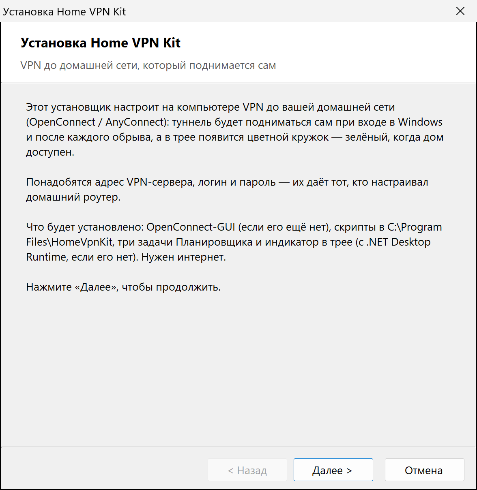
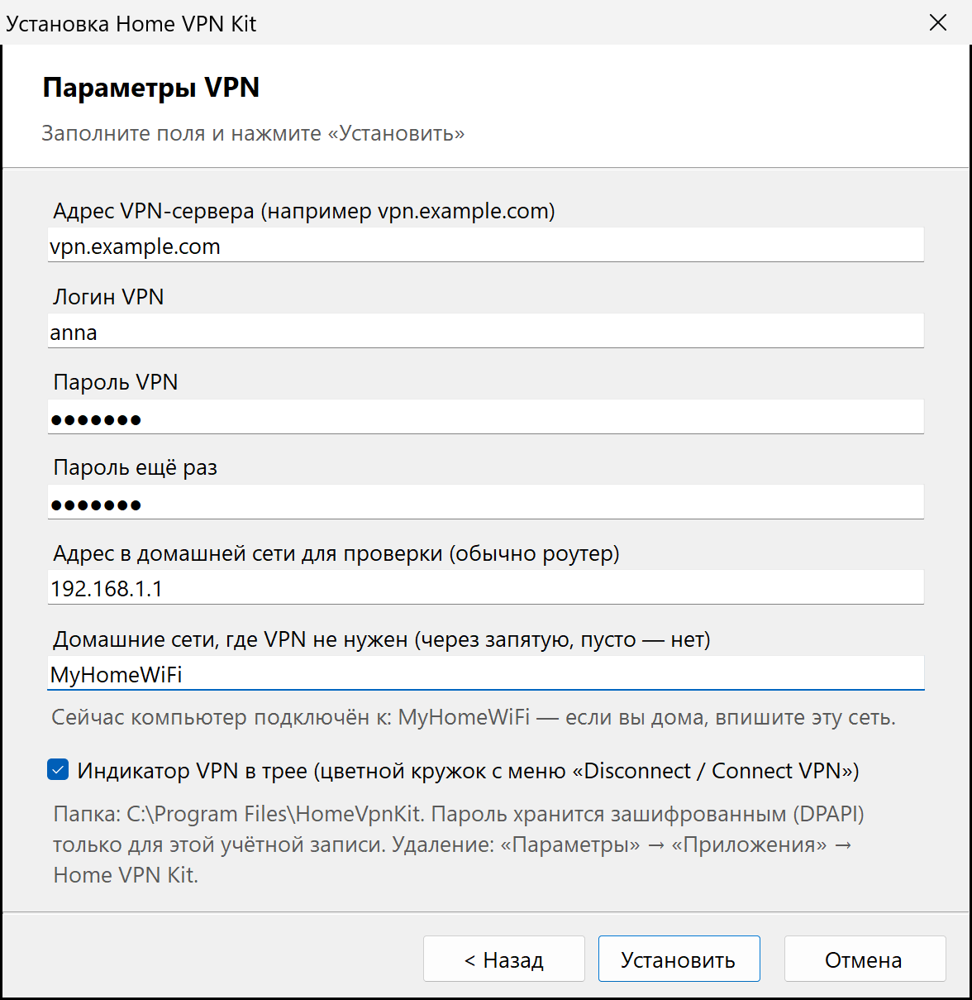

# home-vpn-kit

VPN до домашней сети на Windows «в один клик»: OpenConnect (AnyConnect), который сам поднимается и
переподключается, плюс индикатор в трее с кнопкой «разорвать / подключить».

Сделано для своей семьи: роутер дома раздаёт VPN (например, OpenConnect-сервер Keenetic), а ноутбуки
и компьютеры родных должны быть в домашней сети без ручного «Connect» после каждого обрыва.

## Быстрая установка (Windows, для всех)

1. Скачайте **[HomeVpnKit-Setup.exe](https://github.com/gp131313/home-vpn-kit/releases/latest/download/HomeVpnKit-Setup.exe)**.
2. Запустите его, разрешите запрос прав администратора (один раз).
3. Впишите адрес VPN-сервера, логин и пароль (их даёт тот, кто настраивал домашний роутер) → «Установить» → «Готово».

<p> </p>

Всё. Туннель поднимется сам и будет подниматься при каждом входе в Windows и после обрывов; в трее появится
кружок — зелёный, когда дом доступен. Удаление — «Параметры» → «Приложения» → **Home VPN Kit**.

Если Windows покажет «Система Windows защитила ваш компьютер» — «Подробнее» → «Выполнить в любом случае»
(установщик не подписан). Контрольные суммы файлов релиза — в `SHA256SUMS.txt`.

Чтобы родственнику не вводить адрес и логин, положите рядом с `HomeVpnKit-Setup.exe` файл `config.json`
(пример — `config.example.json`): поля в мастере будут заполнены. Пароль в файл не кладётся никогда.
Повторный запуск установщика обновляет установку и сохраняет пароль и настройки (поле пароля можно оставить пустым).

**Тихий вариант** — `HomeVpnKit-Setup-Silent.exe` (то же даёт ключ `/silent`): без единого окна, кроме запроса
прав администратора. Настройки берёт из `config.json` рядом с exe или из прошлой установки, пароль — из
переменной окружения `HVK_PASSWORD` или уже сохранённый. Ключи: `/server=` `/user=` `/probe=` `/nets=a,b`
`/skiptray` `/dir=<папка>`. Журнал — `%LOCALAPPDATA%\HomeVpnKit\setup.log`.

## Что ставится

| Часть | Что делает |
|---|---|
| [OpenConnect-GUI 1.6.2](https://gui.openconnect-vpn.net/) | даёт `openconnect.exe` 9.12, драйвер Wintun и `vpnc-script-win.js`; ставится только если его нет, со сверкой SHA256 |
| Сторож (`Connect-Vpn.ps1`) | задача Планировщика: при входе и каждые 2 минуты проверяет туннель и при обрыве поднимает его заново |
| Переключатель | задачи «VPN Disconnect» и «VPN Connect»: разорвать туннель и поставить сторожа на паузу / снять паузу |
| [TrayPingMonitor-VPN](https://github.com/gp131313/TrayPingMonitor-VPN) | цветной кружок с подписью VPN в трее; пункт меню разрывает или поднимает VPN; ставится из последнего релиза со сверкой SHA256 |
| .NET 10 Desktop Runtime | нужен индикатору; ставится с сайта Microsoft, если его нет |
| Запись в «Приложениях» | **Home VPN Kit**: удаление штатным способом |

Сторож ничего не делает, если:

- стоит пауза (нажали **Disconnect VPN**);
- компьютер в домашней сети из списка (тогда запущенный туннель гасится — дома он не нужен);
- запущен OpenConnect-GUI — значит, туннелем управляют вручную;
- нет интернета (имя сервера не резолвится).

Туннель считается живым, если адаптер OpenConnect поднят **и** адрес в домашней сети отвечает (по умолчанию
`192.168.1.1:443`). Если туннель висит без трафика 6 минут, `openconnect` перезапускается.

## Другие способы установки

Нужны Windows 10/11 и учётная запись с правами администратора (запрос UAC будет один раз).

**Архив.** Скачать `home-vpn-kit-*.zip` из [Releases](../../releases), распаковать, дважды щёлкнуть `Install.cmd`.
Установщик в консоли спросит адрес VPN-сервера, логин, адрес для проверки (обычно роутер) и имена домашних
сетей, потом — пароль VPN (дважды). В конце он сам запустит сторожа и проверит, что домашняя сеть доступна.

**Одной строкой** в PowerShell (скачает последний релиз, сверит SHA256 и запустит тот же `Install.cmd`):

```powershell
irm https://raw.githubusercontent.com/gp131313/home-vpn-kit/main/get.ps1 | iex
```

Полезные ключи `Install.cmd` (и `install.ps1`):

```
Install.cmd -Check            показать, что установлено и что изменится, ничего не меняя
Install.cmd -ResetPassword    ввести пароль VPN заново
Install.cmd -SkipTray         без индикатора в трее
Install.cmd -InstallDir D:\vpn   другая папка для скриптов
```

Удаление — «Параметры» → «Приложения» → **Home VPN Kit** или `Uninstall.cmd`. OpenConnect-GUI и .NET остаются,
их можно удалить в «Приложениях» отдельно.

## Где что лежит

- Скрипты, `config.json`, пароль (`cred.dat`), журнал `watchdog.log` и `setup\uninstall.ps1` — `C:\Program Files\HomeVpnKit`.
- Индикатор — `%LOCALAPPDATA%\Programs\TrayPingMonitor`, его настройки — `%APPDATA%\TrayPingMonitor\settings.json`.
- Загрузки установщика — `%LOCALAPPDATA%\HomeVpnKit\download`, журнал exe-установщика — `%LOCALAPPDATA%\HomeVpnKit\setup.log`.

## Сборка из исходников

Установщик `HomeVpnKit-Setup.exe` — один файл C# (`setup\Setup.cs`) с вложенными скриптами. Собирается
компилятором из состава Windows (.NET Framework 4.x), SDK не нужен:

```powershell
powershell -NoProfile -ExecutionPolicy Bypass -File setup\build.ps1
```

Результат — `dist\HomeVpnKit-Setup.exe` и `dist\HomeVpnKit-Setup-Silent.exe` (один и тот же файл: тихий режим
выбирается по имени). Манифест `setup\app.manifest` запрашивает права администратора при запуске.
`build.ps1 -NoElevation` собирает тестовый вариант без запроса прав — посмотреть мастер, установка в нём не пройдёт.

## Безопасность

- Пароль VPN хранится зашифрованным DPAPI: расшифровать его может только та же учётка на том же компьютере.
  В журнал и командную строку он не попадает — exe-установщик передаёт его в `install.ps1` через stdin, а
  `openconnect` получает его тоже через stdin.
- Скрипты сторожа выполняются с правами администратора, поэтому писать в их папку могут только
  Администраторы и SYSTEM (установщик выставляет права сам). Иначе любая программа, запущенная без прав,
  могла бы подменить скрипт.
- Сертификат сервера проверяется: установщик выгружает цепочку CA в `ca-bundle.pem` и проверяет её самим
  `openconnect` (`--authenticate --non-inter --no-system-trust`, логин при этом не отправляется). Файл нужен,
  потому что сервер может не присылать промежуточный сертификат (у Let's Encrypt — `Root YR`), а в хранилище
  Windows его может не быть. Если `openconnect` доверяет серверу и так, файл не создаётся. Сертификаты
  Let's Encrypt обновляются без переустановки — меняется только конечный сертификат, цепочка та же.
- Установщик OpenConnect-GUI сверяется по SHA256, зашитой в `install.ps1`; индикатор и .NET — по контрольным
  суммам из их релизов.
- Если в окне UAC ввели пароль другого администратора, exe-установщик остановится: пароль и индикатор
  привязываются к учётке, ставить надо из-под учётки-администратора, которой нужен VPN.

## Ограничения и крайние случаи

- Только протокол AnyConnect (`--protocol=anyconnect`) и вход по логину/паролю, без одноразовых кодов.
- Туннель поднимается для той учётки, под которой запускали установку.
- При полном туннеле (весь трафик идёт через дом) **Disconnect VPN** рвёт и все сеансы, которые шли через него.
- Дома без VPN адрес проверки отвечает напрямую, поэтому пункт меню покажет **Disconnect VPN** — нажатие
  только поставит сторожа на паузу.
- Сторож уступает OpenConnect-GUI: пока GUI запущен, туннель не трогается.
- **Антивирус с проверкой защищённых соединений** (например, Kaspersky) может подменять сертификаты для PowerShell,
  но не для `openconnect`. Установщик это распознаёт: такую цепочку не сохраняет, пробует `ca-bundle.pem`,
  положенный рядом с установщиком, прежний файл и хранилище Windows. Если не подошло ничего — возьмите
  `ca-bundle.pem` из папки установки на компьютере, где VPN работает, и положите рядом с `Install.cmd`.
- У задачи «VPN Watchdog (OpenConnect)» в Планировщике «Результат последнего запуска» `0x800710E0` — норма:
  сторож, поднявший туннель, остаётся с ним, а очередные запуски раз в 2 минуты пропускаются (`IgnoreNew`).
- Повторная установка сохраняет по три последних копии заменённых файлов: `*.bak_ГГГГММДД_ЧЧММСС`.

## Структура

```
setup/Setup.cs          установщик одним файлом: мастер и тихий вариант (скрипты внутри exe)
setup/app.manifest      запрос прав администратора, DPI
setup/build.ps1         сборка компилятором C# из состава Windows, без SDK
install.ps1             сама установка: OpenConnect, скрипты, пароль, CA, ACL, задачи, «Приложения», индикатор
uninstall.ps1           удаление (-Gui из «Приложений», -Quiet тихо)
Install.cmd / Uninstall.cmd   запуск из архива с запросом прав
get.ps1                 установка одной строкой из последнего релиза
vpn/Connect-Vpn.ps1     сторож туннеля
vpn/Disconnect-Vpn.ps1, vpn/Resume-Vpn.ps1   пауза / продолжение (пункт меню индикатора)
config.example.json     пример настроек
docs/                   скриншоты для README
```

## Поддержать

Если комплект пригодился — можно кинуть на кофе, см. [DONATE.md](DONATE.md):

- **Dogecoin**: `D7z9UaBsmcV7EqJo5Y5fdLG9xUNw47dNgr`

## Лицензия

MIT — см. [LICENSE](LICENSE). Индикатор [TrayPingMonitor-VPN](https://github.com/gp131313/TrayPingMonitor-VPN)
распространяется отдельно под GPL-2.0 и скачивается из своего релиза; OpenConnect — под LGPL-2.1.

---

## English

One-click home VPN for Windows: an OpenConnect (AnyConnect) tunnel that brings itself back up, plus a tray
indicator with a Disconnect/Connect menu item. Download
[HomeVpnKit-Setup.exe](https://github.com/gp131313/home-vpn-kit/releases/latest/download/HomeVpnKit-Setup.exe),
allow the administrator prompt, enter the VPN server, login and password, click Install. The wizard speaks
Russian or English depending on the Windows display language. `HomeVpnKit-Setup-Silent.exe` installs without
windows (settings from `config.json` next to it, password from `HVK_PASSWORD`). The installer sets up
OpenConnect-GUI 1.6.2 if missing (SHA256-checked), stores the password with DPAPI, verifies the server CA chain
with openconnect itself, registers a watchdog scheduled task (at logon and every 2 minutes) plus on-demand
"VPN Disconnect"/"VPN Connect" tasks, locks the script folder to Administrators, adds a Settings → Apps entry
and installs [TrayPingMonitor-VPN](https://github.com/gp131313/TrayPingMonitor-VPN) with .NET 10 Desktop Runtime.
Build the exe with `setup\build.ps1` (the C# compiler that ships with Windows, no SDK). License: MIT.
